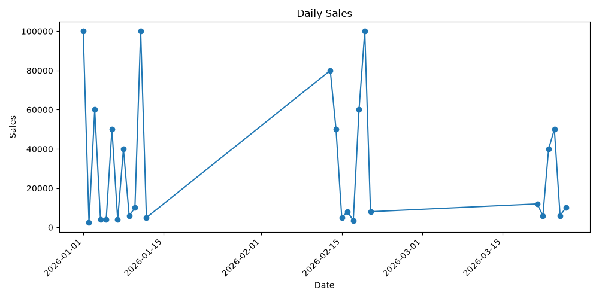
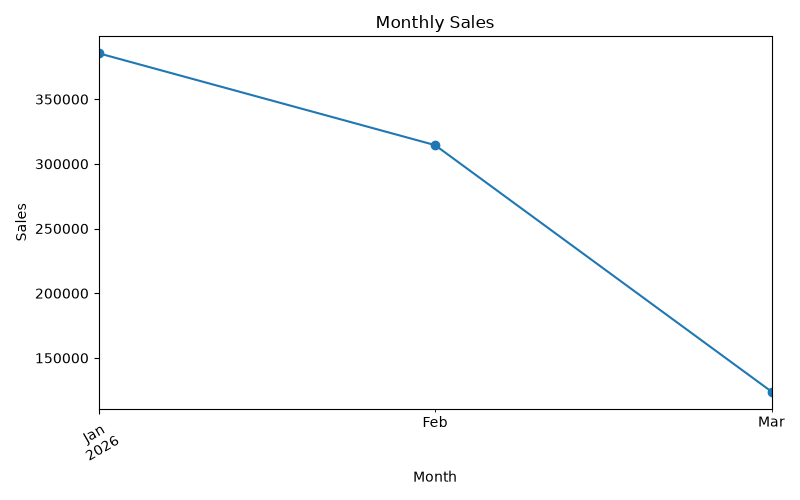
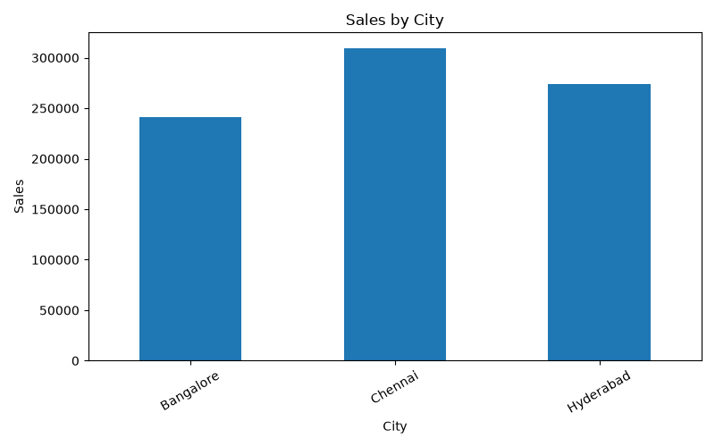
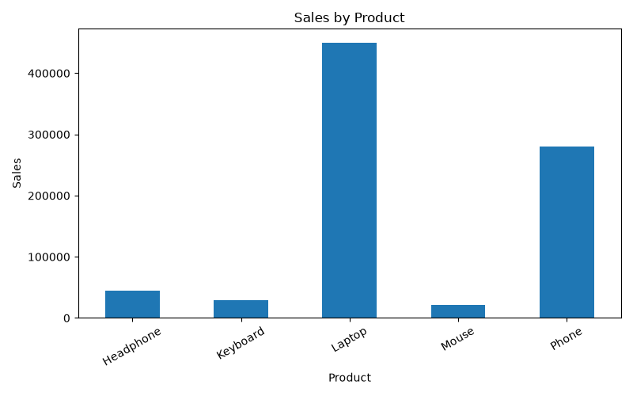

# Sales Data Analysis Using Python

## 📌 Project Overview

This project analyzes sales data using Python to understand sales performance and identify meaningful business insights.

The analysis focuses on sales, profit, products, customers, cities, and monthly sales trends.

## 🎯 Objectives

- Analyze overall sales and profit performance
- Identify top-selling products
- Find top-performing customers
- Analyze sales by city
- Identify monthly sales trends
- Generate meaningful business insights
- Create visualizations to understand the data easily

## 🛠️ Tools & Technologies

- Python
- Pandas
- NumPy
- Matplotlib

## 📊 Analysis Performed

- Data loading
- Data cleaning
- Data exploration
- Sales analysis
- Profit analysis
- Product analysis
- Customer analysis
- City-wise analysis
- Monthly sales analysis
- Data visualization

## 🔍 Key Analysis Performed

### 💰 Sales & Profit Analysis

Calculated overall sales and profit to understand business performance.

### 📦 Product Analysis

Identified top-performing products based on sales.

### 👥 Customer Analysis

Analyzed customer-level sales to identify top customers.

### 🌍 City Analysis

Compared sales performance across different cities.

### 📅 Monthly Sales Trends

Analyzed monthly sales to identify changes and trends in sales performance.

## 📸 Project Preview

### Daily Sales

### Monthly Sales

### Sales by City

### Sales by Product

## 💡 Business Insights

The analysis helps businesses understand:

- Which products generate higher sales
- Which customers contribute more to revenue
- Which cities perform better
- How sales change over time
- Overall sales and profit performance

These insights can support data-driven business decision-making.

## ▶️ How to Run the Project

### 1. Clone the Repository

    git clone https://github.com/msmadhumitha11/Sales-Data-Analysis.git

### 2. Navigate to the Project Folder

    cd Sales-Data-Analysis

### 3. Install Required Libraries

    pip install -r requirements.txt

### 4. Run the Python Script

    python Sales_analysis.py
    
## 📁 Project Structure

    Sales-Data-Analysis/
    │
    ├── README.md
    ├── Sales_analysis.py
    ├── Sales_data.csv
    ├── requirements.txt
    ├── .gitignore
    ├── data_dictionary.md
    │
    └── screenshots/
        ├── Daily_sales.png
        ├── Monthly_sales.png
        ├── Sales_by_city.png
        └── Sales_by_product.png

## 🚀 Future Improvements

- Add an interactive dashboard using Power BI
- Perform advanced statistical analysis
- Add more visualizations
- Analyze additional business metrics
- Automate the data analysis process

## 👩‍💻 Author

M S Madhumitha

B.Tech Student | Aspiring Data Analyst
